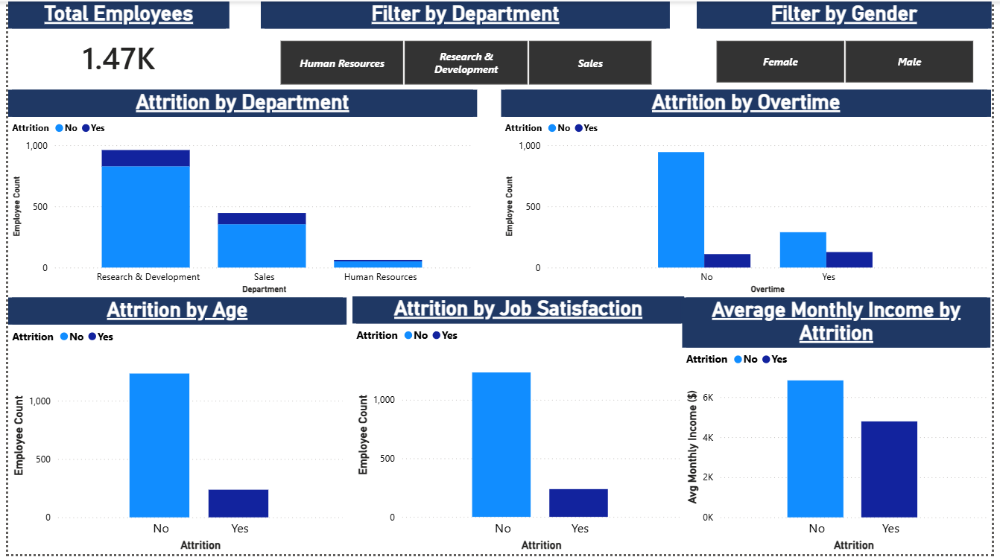
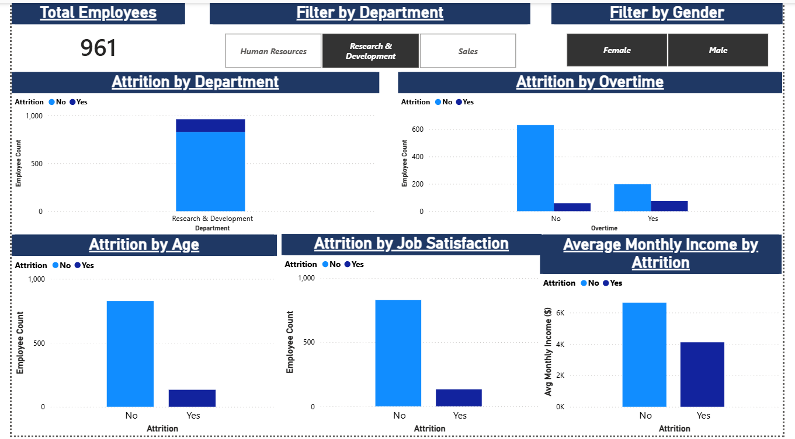
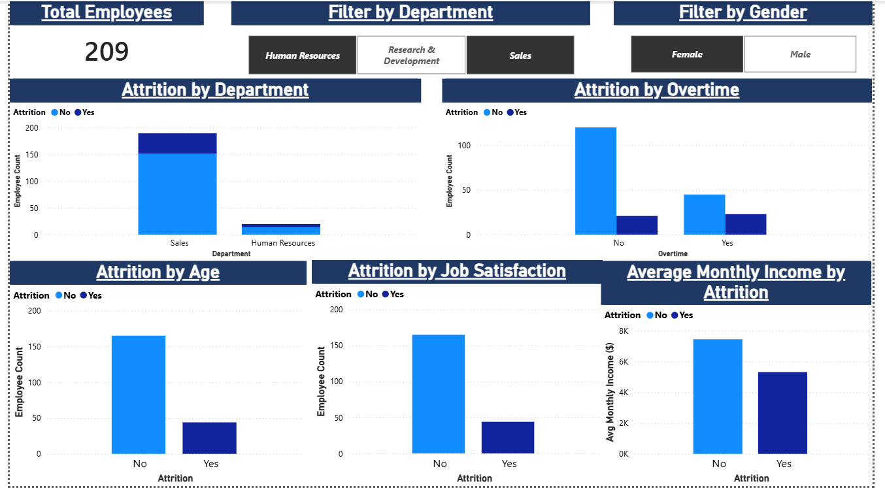

# Employee Attrition Analysis

An end-to-end data analysis project exploring employee attrition patterns using the IBM HR Analytics dataset. The project involves database setup, SQL-based analysis, and an interactive Power BI dashboard.

**Project Date:** June 24, 2026

## Tools Used
- PostgreSQL (database & SQL analysis)
- pgAdmin (database management)
- Power BI Desktop (dashboard & visualization)

## Dataset
- **Source:** [IBM HR Analytics Employee Attrition & Performance](https://www.kaggle.com/datasets/pavansubhasht/ibm-hr-analytics-attrition-dataset)
- **Records:** 1,470 employees | 35 columns
- **Type:** Synthetic data created by IBM data scientists
- **License:** CC0 Public Domain

## SQL Analysis
Seven queries were written to uncover attrition patterns:
- Overall attrition rate
- Attrition by department
- Attrition by age group
- Attrition by income bracket
- Attrition by overtime
- Attrition by job satisfaction
- Average tenure by attrition

## Key Findings
- Overall attrition rate is **16.1%** (237 out of 1,470 employees)
- **Sales** and **Human Resources** departments have higher attrition than Research & Development
- Employees working **overtime** leave at a significantly higher rate
- **Lower income** employees (under $3,000/month) show the highest attrition
- Employees who left had a **shorter average tenure** compared to those who stayed
- **Lower job satisfaction** scores correlate with higher attrition

## Dashboard
The Power BI dashboard includes:
- Total employee count card
- Attrition by Department
- Attrition by Overtime
- Attrition by Age
- Attrition by Job Satisfaction
- Average Monthly Income by Attrition
- Interactive filters for Department and Gender

### Full Dashboard

### Filtered by Research & Development

### Filtered by Female, HR & Sales

